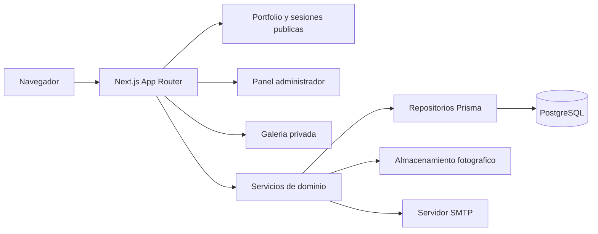

# Arquitectura de Trashpanda Garage

## Proposito

Este documento explica como esta dividido el monolito Next.js, donde debe vivir cada responsabilidad y como viajan los datos en los flujos principales. Describe el codigo actual; no propone microservicios ni capas hipoteticas.

## Vista general

## Limites del codigo

| Area | Ruta | Responsabilidad |
| --- | --- | --- |
| Rutas y composicion | `src/app` | Paginas, endpoints HTTP, Server Actions, redirecciones y metadata. |
| Componentes publicos | `src/components/public` | Portfolio, navegacion, sesiones y collage editorial. |
| Galeria del cliente | `src/components/gallery` | Seleccion, comentarios, confirmacion y entrega. |
| Administracion | `src/components/admin` | Tablas, formularios y acciones del panel. |
| Dominio | `src/modules` | Casos de uso de clientes, galerias, fotos, selecciones, correo y almacenamiento. |
| Infraestructura compartida | `src/lib` | Sesion, entorno, Prisma, validadores, tokens y carga de sesiones publicas. |
| Persistencia | `prisma/schema.prisma` | Modelo relacional y enumeraciones del dominio. |
| Operaciones | `scripts` | Seed del administrador, importacion de fotos y exportacion de selecciones. |

La direccion de dependencia esperada es `app/components -> modules -> repositories/db`. Los componentes no deben consultar Prisma directamente. Las rutas pueden componer servicios y repositorios cuando necesitan preparar una vista, pero las reglas que modifican estado deben permanecer en servicios de dominio.

## Flujos principales

### Acceso administrador

1. `/admin/login` valida el formulario mediante `loginAdmin`.
2. `src/lib/auth.ts` compara el secreto recibido con el hash almacenado.
3. Una cookie HTTP-only firmada identifica la sesion.
4. `AdminShell` exige un administrador antes de renderizar el panel.

El seed consume `ADMIN_EMAIL` y `ADMIN_PASSWORD` solo desde el entorno. La base de datos conserva un hash, no una contrasena recuperable.

### Galeria privada

1. `/g/[token]` carga una galeria accesible por su token.
2. `ClientGallery` mantiene el estado optimista en el navegador.
3. Los endpoints `/api/galleries/[token]/selection` y `/confirm` delegan las reglas a `src/modules/selections`.
4. Las fotos se sirven desde `/api/photos/[id]` despues de validar acceso y variante.

### Sesiones publicas

1. `src/lib/public-sessions.ts` lee `PHOTO_STORAGE_ROOT/sessions`.
2. Cada sesion publicada contiene `session.md`, `cover` y `content`.
3. `/sessions` lista las sesiones y `/sessions/[slug]` presenta una sesion.
4. `/api/public-sessions/[slug]/[folder]/[filename]` sirve solamente imagenes admitidas dentro de la raiz configurada.

### Collage editorial

`PhotoCollage.tsx` coordina estado, medicion y carga de proporciones. `photo-collage-layout.ts` contiene el algoritmo puro de filas justificadas y `PhotoCollageLightbox.tsx` contiene el dialogo, teclado y bloqueo de scroll. Esta division permite probar el layout sin montar React y evita mezclar calculo con interaccion visual.

## Reglas de mantenimiento

- Elimina codigo solo cuando TypeScript, una busqueda de consumidores o Knip demuestre que no se usa.
- No muevas reglas de negocio a componentes o rutas para ahorrar un archivo.
- Conserva los componentes pequenos junto a su area; extrae un helper cuando separa calculo puro, infraestructura o una responsabilidad visual completa.
- Actualiza este documento y regenera `graphify-out` cuando cambien limites, rutas o dependencias relevantes.
- Valida cada refactor con `npm run lint`, `npm test` y `npm run build`.

## Decisiones y compromisos

El monolito modular sigue siendo adecuado: comparte despliegue y transacciones, y el volumen actual no justifica microservicios. El costo es que las fronteras dependen de disciplina de imports; las pruebas y el grafo Graphify ayudan a detectar acoplamiento creciente.
